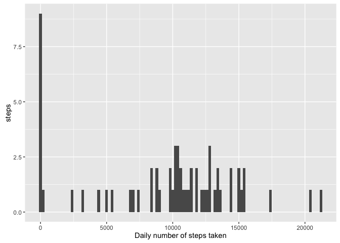
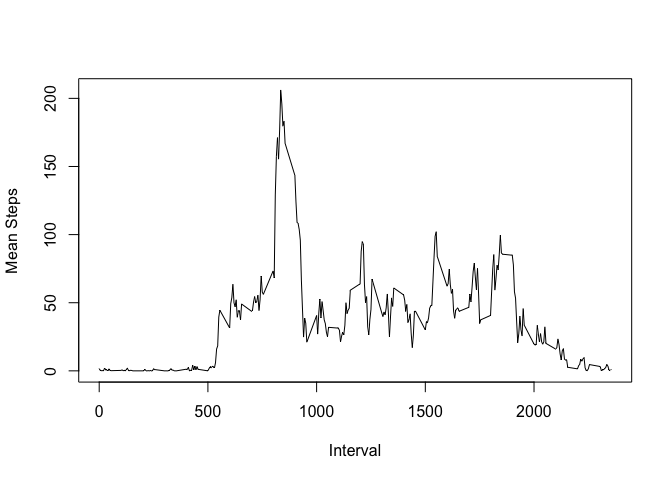
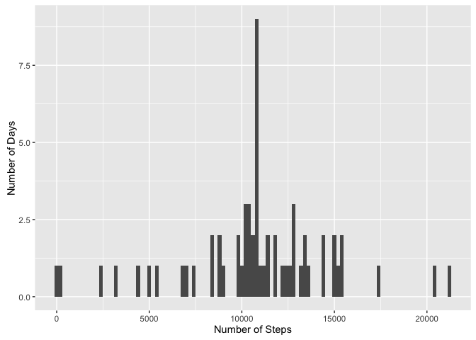
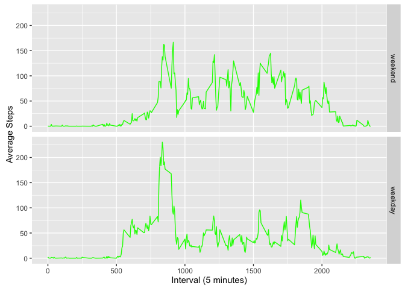

PA1\_template.md
================

### Loading and preprocessing the data

Load the required R packages.

``` r
library(ggplot2)
library(dplyr)
```

Set the working directory and read preprocessed data

``` r
setwd("~/Desktop/coursera")
read_data <- read.csv("activity.csv")
```

Remove NA values from dataset and removed the corresponding date factors associated with those NA values

``` r
read_data_removeNA <- read_data[!is.na(read_data$steps), ]
read_data_removeNA$date <- factor(read_data_removeNA$date)
```

### What is the mean total number of steps taken per day?

Calculate the number of steps taken per day

``` r
total_steps <- aggregate(read_data$steps, by = list(read_data$date), sum, na.rm = TRUE)
names(total_steps) <- c("Date", "Steps")
```

Plot results in histogram of total number of steps taken each day

``` r
qplot(Steps, data = total_steps, geom = "histogram", 
      xlab = "Daily number of steps taken", ylab = "steps", binwidth = 200 )
```



Calculate the mean and median of the total number of steps taken per day

``` r
mean(total_steps$Steps)
```

    ## [1] 9354.23

``` r
median(total_steps$Steps)
```

    ## [1] 10395

### What is the Average daily activity pattern?

Calculate the steps per interval averaged across all days and plot the results

``` r
meanStepsPerInterval <- tapply(read_data_removeNA$steps, as.factor(read_data_removeNA$interval), mean)
meanStepsPerInterval <- as.data.frame(meanStepsPerInterval)
meanStepsPerInterval$interval <- rownames(meanStepsPerInterval)
plot(meanStepsPerInterval$interval, meanStepsPerInterval$mean, type = 'l', ylab = "Mean Steps", xlab = "Interval")
```



Get the interval with the highest average number of steps on average.

``` r
meanStepsPerInterval[meanStepsPerInterval$mean == max(meanStepsPerInterval$mean), ][1]
```

    ##     meanStepsPerInterval
    ## 835             206.1698

### Imputing missing values

Calculate and report the total number of missing values in the dataset

``` r
nrow(read_data[is.na(read_data$steps), ])
```

    ## [1] 2304

For all data points with NA steps, impute the average number of steps for that interval.

``` r
meanStepsPerInterval$interval <- as.integer(meanStepsPerInterval$interval)
read_data.filledIn <- merge(read_data, meanStepsPerInterval, by = "interval")
read_data.filledIn$steps[is.na(read_data.filledIn$steps)] <- read_data.filledIn$meanStepsPerInterval[is.na(read_data.filledIn$steps)]
```

Calculate and plot a histogram of the numbers of steps per day using the newly created dataset

``` r
sumByDay.filledIn <- as.data.frame(tapply(read_data.filledIn$steps, as.factor(read_data.filledIn$date), sum))
names(sumByDay.filledIn) <- c("Steps")
qplot(sumByDay.filledIn$Steps, geom = "histogram", ylab = "Number of Days", xlab = "Number of Steps", binwidth = 200)
```



Calculate the mean and median total number of steps per day

``` r
print(mean(sumByDay.filledIn$Steps), row.names = FALSE)
```

    ## [1] 10766.19

``` r
print(median(sumByDay.filledIn$Steps), row.names = FALSE)
```

    ## [1] 10766.19

### Are there differences in activity patterns between weekdays and weekends?

Create a factor that classifies each date as either a "weekday" or "weekend"

``` r
read_data.filledIn$dow <- weekdays(as.Date(read_data.filledIn$date))

WeekdayFlag <- c('Monday', 'Tuesday', 'Wednesday', 'Thursday', 'Friday')

read_data.filledIn$dtype <- factor(weekdays(as.Date(read_data.filledIn$date)) %in% WeekdayFlag, levels = c(FALSE, TRUE), labels = c('weekend', 'weekday'))
```

Calculate the steps per interval averaged across day type ("weekday" or "weekend") and plot the results in a time series.

``` r
averages <- aggregate(steps ~ interval + dtype, data = read_data.filledIn, mean)
ggplot(averages, aes(interval, steps)) + geom_line(colour = "green") + facet_grid(dtype ~ .) + xlab("Interval (5 minutes)") + ylab("Average Steps")
```


